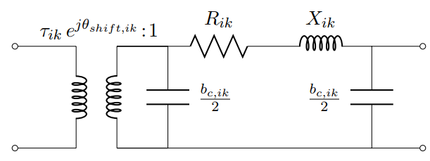
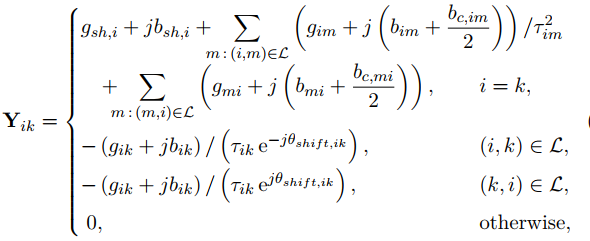
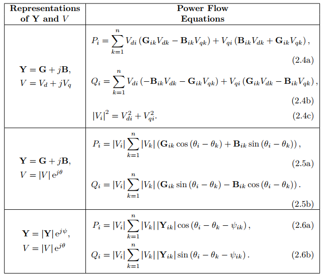

# Mathematical Model

- [Power Flow Model](@ref)
- [Nodal Constraint Model](@ref)
- [Generator Cranking Model](@ref)
- [Generator Dispatch Model](@ref)
- [Load Dispatch Model](@ref)


## Sets, Parameters and Variables
```math
\begin{align*}
%
\mbox{Indices and Sets:} &  \\
& i,j\in N \mbox{ - buses} \\
& b\in B \mbox{ - branches} \\
& g\in G \mbox{ - generators} \\
& l\in L \mbox{ - loads} \\
%
\mbox{Parameters:} &  \\
& Pcr_{g} \quad\forall g \in G \mbox{ - generator cranking power: power needed for the unit to be normally functional}\\
& Tcr_{g} \quad\forall g \in G \mbox{ - generator cranking time: time needed for the unit to be normally functional}\\
& Krp_{g} \quad\forall g \in G \mbox{ - generator ramping rate} \\
%
\mbox{Binary Variables:} &  \\
& x_{ij,t} \mbox{ - status of line $ij$ at time $t$}\\
& y_{g,t} \mbox{ - status of generator $g$ at time $t$}\\
& u_{i,t} \mbox{ - status of bus $i$ at time $t$}\\
%
\mbox{Continuous Variables:} &  \\
& v_{i,t} \mbox{ - voltage of bus $i$ at time $t$}\\
& a_{i,t} \mbox{ - relative angle of bus $i$ at time $t$}\\
& vl_{ij,t} \mbox{ - supplementary variables for voltage of bus $i$ (connected to bus $j$) at time $t$}\\
& vb_{i,t} \mbox{ - supplementary variables for voltage of bus $i$ at time $t$}\\
& al_{ij,t} \mbox{ - supplementary variables for relative angle of bus $i$ (connected to bus $j$) at time $t$}\\
& pl_{l,t} \mbox{ - active power of load $l$ at time $t$}\\
& ql_{l,t} \mbox{ - reactive power of load $l$ at time $t$}\\
& pg_{l,t} \mbox{ - active power of generator $g$ at time $t$}\\
& qg_{l,t} \mbox{ - reactive power of generator $g$ at time $t$}\\
& p_{bij,t} \mbox{ - active power flow of branch $b$ (bus $i$ and $j$) at time $t$}\\
& q_{bij,t} \mbox{ - reactive power flow of branch $b$ (bus $i$ and $j$) at time $t$}\\
\end{align*}
```

## Power Flow Model
The formulations of branch constraints are implemented in function `form_branch`.
### AC power flow
The typical π-circuit line model with an ideal transformer is used to model the standard "AC" power flow:


The Y-bus can be formulated as follows:


Three representations of AC power flow can be found below:


(Ref: Molzahn, Daniel K., and Ian A. Hiskens. "A survey of relaxations and approximations of the power flow equations." *Foundations and Trends® in Electric Energy Systems* 4, no. 1-2 (2019): 1-221.)

### DC power flow
The standard "DC" approximation to AC power flow linearizes these equations by using the approximations $v_{i}=v_{j}=1$, $sinα_{ij}=α_{ij}$, $cosα_{ij}=1$, and $b_{l}>>g_{l}=0$ yielding:
```math
\begin{align*}
p_{ij}=B_{ij}α_{ij}
\end{align*}
```

### Linearized AC power flow
Expanding the line flows about $v_{i}=v_{j}=1$, $α_{ij}=0$ and making small-angle approximations $sinα_{ij}=α_{ij}$ and $cosα_{ij}=1$ yielding linearized AC power flow
```math
\begin{align*}
& p_{ij,t}=G_{ii}(2v_{i,t}-1) + G_{ij}(v_{i,t} + v_{j,t}-1) + B_{ij}\sinα_{ij}\\
& q_{ij,t}=-B_{ii}(2v_{i,t}-1) - B_{ij}(v_{i,t} + v_{j,t}-1) + G_{ij}\cosα_{ij}\\
\end{align*}
```
where voltage and reactive power are retained.

(Ref: Trodden, Paul A., Waqquas Ahmed Bukhsh, Andreas Grothey, and Ken IM McKinnon. "Optimization-based islanding of power networks using piecewise linear AC power flow." *IEEE Transactions on Power Systems* 29, no. 3 (2013): 1212-1220.)

### Linearized AC power flow with bus and line energization
```math
\begin{align*}
p_{bij,t}=G_{ii}(2vl_{ij,t}-x_{ij,t}) + G_{ij}(vl_{ij,t} + vl_{ji,t}-x_{ij,t}) + B_{ij}(al_{ij,t}-al_{ij,t})\\
q_{bij,t}=-B_{ii}(2vl_{ij,t}-x_{ij,t}) - B_{ij}(vl_{ij,t} + vl_{ji,t}-x_{ij,t}) + G_{ij}(al_{ij,t}-al_{ij,t})\\
\end{align*}
```

## Nodal Constraint Model
The formulations of nodal constraints are implemented in function `form_nodal`.
- Voltage Constraint
    - voltage deviation should be limited
    - voltage constraints are only activated if the associated line is energized
```math
\begin{align*}
    & v^{\min}_{i} \leq v_{i,t} \leq v^{\max}_{i}\\
    & v^{\min}_{i}x_{ij,t} \leq vl_{ij,t} \leq v^{\max}_{i}x_{ij,t}\\
    & v^{\min}_{j}x_{ij,t} \leq vl_{ji,t} \leq v^{\max}_{j}x_{ij,t}\\
    & v_{i,t} - v^{\max}_{i}(1-x_{ij,t}) \leq vl_{ij,t} \leq v_{i,t} - v^{\min}_{i}(1-x_{ij,t})\\
    & v_{j,t} - v^{\max}_{j}(1-x_{ij,t}) \leq vl_{ij,t} \leq v_{j,t} - v^{\min}_{j}(1-x_{ij,t})
\end{align*}
```
- Angle Difference Constraint
    - angle difference should be limited
    - angle difference constraints are only activated if the associated line is energized
```math
 \begin{align*}
     & a^{\min}_{ij} \leq a_{i,t}-a_{j,t} \leq a^{\max}_{ij}\\
     & a^{\min}_{ij}x_{ij,t} \leq al_{ij,t}-al_{ji,t} \leq a^{\max}_{ij}x_{ij,t}\\
     & a_{i,t}-a{j,t}-a^{\max}_{ij}(1-x_{ij,t}) \leq al_{ij,t}-al_{ji,t} \leq a_{i,t}-a_{j,t}-a^{\min}_{ij}(1-x_{ij,t})
 \end{align*}
```
- Generator and Bus Energizing Logics
    - on-line generator cannot be shut down
    - bus should be energized before the connected genertor being on
```math
\begin{align*}
 & x_{ij,t} \geq x_{ij,t-1}\\
 & u_{i,t} \geq x_{ij,t}\\
 & u_{j,t} \geq x_{ij,t}
\end{align*}
```
- Bus Energized Constraints
    - bus energized indicating generator energized
    - on-line buses cannot be shut down
```math
\begin{align*}
& v^{\min}u_{i,t} \leq vb_{i,t} \leq v^{\max}u_{i,t} \\
& v_{i,t} - v^{\max}(1-u_{i,t}) \leq vb_{i,t} \leq v_{i,t} - v^{\min}(1-u_{i,t})\\
& u_{g,t} = y_{g,t}\\
& u_{i,t} \geq u_{i,t-1}
\end{align*}
```
- Nodal Power Balance Constraint
```math
\begin{align*}
& \sum_{b}p_{b,t}=\sum_{g\in b}pg_{g,t}-\sum_{l\in b}pl_{l,t}\\
& \sum_{b}q_{b,t}=\sum_{g\in b}qg_{g,t}-\sum_{l\in b}ql_{l,t}
\end{align*}
```


## Generator Cranking Model
The formulations of generator cranking constraints are implemented in function `form_bs_logic`.

The capacity curve for non-black start generator is simplifed and modeled as a piecewise linear function of time shown below.


(Ref: Qiu, Feng, and Peijie Li. "An integrated approach for power system restoration planning." *Proceedings of the IEEE* 105, no. 7 (2017): 1234-1252.)

Once a non-black start generator is on, that is, $y_{g,t}=1$, then it needs to absorb the cranking power for its corresponding cranking time. "After" the time step that this unit satisfies its cranking constraint, its power goes to zero; and from the next time step, it becomes a dispatchable generator
- set non-black start unit generation limits based on "generator cranking constraint"
- cranking constraint states if generator g has absorb the cranking power for its corresponding cranking time, it can produce power
Mathematically if there exist enough 1 for $y_{g,t}=1$, then enable this generator's generating capability. There will be the following scenarios
- (1) generator is off, then $y_{g,t}-y_{g,t-Tcr_{g}} = 0$, then $pg_{g,t} = 0$
- (2) generator is on but cranking time not satisfied, then $y_{g,t} - y_{g,t-Tcr_g} = 1$, then $pg_{g,t} = -Pcr_g$
- (3) generator is on and just satisfies the cranking time, then $y_{g,t} - y_{g,t-Tcr_g} = 0$, $y_{g,t-Tcr_g-1}=0$, then $pg_{g,t} = 0$
- (4) generator is on and bigger than satisfies the cranking time, then $y_{g,t} - y_{g,t-Tcr_g} = 0$, $y_{g,t-Tcr_g-1}=1$, then $0 <= pg_{g,t} <= pg^{\max}_{g}$
All scenarios can be formulated as follows:
```math
\begin{align*}
& pg^{\min}_{g} \leq pg_{g,t} \leq pg^{\max}_{g}\\
& \text{ if }t > Tcr_{g}+1\\
& \quad\quad -Pcr_{g}(y_{g,t}-y_{g,Tcr_{g}}) \leq pg_{g,t} \leq pg^{\max}_{g}y_{g,t-Tcr_{g}-1}-Pcr_{g}(y_{g,t} - y_{g,t-Tcr_{g}}) \\
& \text{ elseif }t \leq Tcr_{g}\\
& \quad\quad pg_{g,t} = -Pcr_{g}y_{g,t}\\
& \text{else }\\
& \quad\quad pg_{g,t} = -Pcr_{g}(y_{g,t} - y_{g,1})
\end{align*}
```

## Generator Dispatch Model
The formulations are implemented in function `form_gen_logic`.
- Generator ramping rate constraint
```math
\begin{align*}
-Krp_{g} \leq pg_{g,t}-pg_{g,t+1} \leq Krp_{g}
\end{align*}
```
- Black-start unit is determined by the cranking power
```math
\begin{align*}
y_{g,t}=1 \text{  if  } Pcr_{g}=0
\end{align*}
```
- On-line generators cannot be shut down
```math
\begin{align*}
y_{g,t} <= y_{g,t+1}
\end{align*}
```

## Load Dispatch Model
The formulations are implemented in function `form_load_logic`.
- restored load cannot exceed its maximum values
```math
\begin{align*}
& 0 \leq pl_{l,t} \leq pl^{\max}u_{l,t}\\
& 0 \leq ql_{l,t} \leq ql^{\max}u_{l,t}\\
\end{align*}
```
- restored load cannot be shed
```math
\begin{align*}
& pl_{l,t-1} \leq pl_{l,t}\\
& ql_{l,t-1} \leq ql_{l,t}\\
\end{align*}
```
