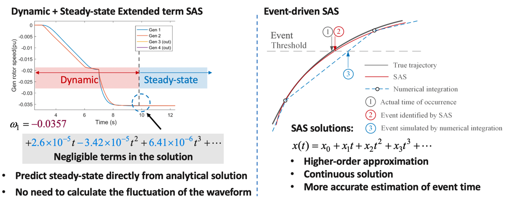

# Advanced Algorithms

## Multi-Resolution Approach
We developed a multi-resolution restoration algorithm to accelerate the overall solution time and prepare the software package for large-scale systems. The approach is based on the fact that better solutions can be found with smaller time steps, that is, higher resolution, which results in more complex optimization model. In addition, it is often difficult for the solver to obtain a feasible solution when the time step is small. Therefore, the essence of the algorithm is to hierarchically increase the resolution (that is, decrease the time steps) and guide the search of higher-resolution problem using solutions from lower-resolution solutions. Specifically, generator decision variables at certain time interval will be fixed to either zero or one depending on the result from the previous step. The algorithm is illustrated in Figure 1, where Figure 1 (a) shows the step of the approach and Figure 1 (b) illustrate the fixing rules.

We verify the method on the black start problem for the IEEE 39-bus system. The computation results are shown in Table 1. In Scenario 3, the solver cannot reach to convergence after 7000 seconds. On the other hand, the proposed method can save 40% of the computation time without loss of optimality. This preliminary computation experiments verify the effectiveness of our proposed approach.

## Enhanced Extended-Term Event-Driven Simulation
We enhanced the extended-term simulation approach based on semi-analytical simulation (SAS) for restoration studies. And we implemented hybrid simulation switching between the full-dynamic simulation and quasi-steady-state (QSS) simulation. The switch from full-dynamic simulation to QSS simulation is realized directly from SAS coefficients, which is much more efficient than the traditional method that needs extra period of simulation.

We further use SAS to simulate a restoration process of IEEE 39-bus system. The whole process lasts 12,065s and includes 396 events, including bus energization, line energization, line switching, generator cut-in, generator ramping, load cut-in, load ramping events. The QSS simulation covers about 39% of the whole process, and the time saving compared with full-dynamic simulation is about 36%. This verifies that QSS simulation is much faster than the full-dynamic simulation, and the hybrid simulation can significantly enhance efficiency without losing accuracy.

