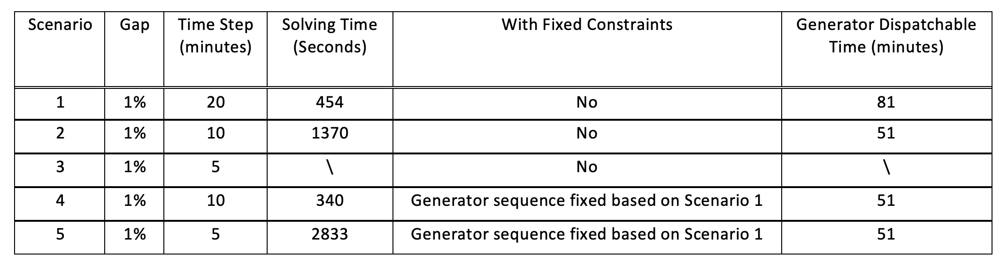

# Advanced Algorithms

## Multi-Resolution Approach
In this quarter, we developed a multi-resolution restoration algorithm to accelerate the overall solution time and prepare the software package for large-scale systems. The approach is based on the fact that better solutions can be found with smaller time steps, that is, higher resolution, which results in more complex optimization model. In addition, it is often difficult for the solver to obtain a feasible solution when the time step is small. Therefore, the essence of the algorithm is to hierarchically increase the resolution (that is, decrease the time steps) and guide the search of higher-resolution problem using solutions from lower-resolution solutions. Specifically, generator decision variables at certain time interval will be fixed to either zero or one depending on the result from the previous step. The algorithm is illustrated in Figure 1, where Figure 1 (a) shows the step of the approach and Figure 1 (b) illustrate the fixing rules.

We verify the method on the black start problem for the IEEE 39-bus system. The computation results are shown in Table 1. In Scenario 3, the solver cannot reach to convergence after 7000 seconds. On the other hand, the proposed method can save 40% of the computation time without loss of optimality. This preliminary computation experiments verify the effectiveness of our proposed approach.

## Extended-Term Simulation
