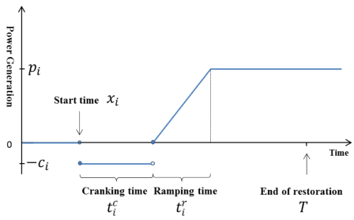

# Problem Formulation

`EGRIP.jl` currently provides two types of restoration problem formulations:
- [Restoration with Network Energization and Power Flow](@ref): This problem formulation models the detailed network energization sequences and power flow constraints. The obtained results can be highly reliable but the computation complexity is high.
- [Generator Start-up Sequence Optimization](@ref): This problem formulation focuses on the optimal generator start-up sequence, which is essential in the overall restoration problem. Here the power balance constraint is considered instead of the network energization and power flow constraints. The computation complexity is low but the results may need further verification.


## Restoration with Network Energization and Power Flow
The problem formulations are implemented in function `solve_restoration_full`.

### Sets, Parameters and Variables
```math
\begin{align*}
%
\mbox{Indices and Sets:} &  \\
& i,j\in N \mbox{ - buses} \\
& b\in B \mbox{ - branches} \\
& g\in G \mbox{ - generators} \\
& l\in L \mbox{ - loads} \\
%
\mbox{Parameters:} &  \\
& Pcr_{g} \quad\forall g \in G \mbox{ - generator cranking power: power needed for the unit to be normally functional}\\
& Tcr_{g} \quad\forall g \in G \mbox{ - generator cranking time: time needed for the unit to be normally functional}\\
& Krp_{g} \quad\forall g \in G \mbox{ - generator ramping rate} \\
%
\mbox{Binary Variables:} &  \\
& x_{ij,t} \mbox{ - status of line $ij$ at time $t$}\\
& y_{g,t} \mbox{ - status of generator $g$ at time $t$}\\
& u_{i,t} \mbox{ - status of bus $i$ at time $t$}\\
%
\mbox{Continuous Variables:} &  \\
& v_{i,t} \mbox{ - voltage of bus $i$ at time $t$}\\
& a_{i,t} \mbox{ - relative angle of bus $i$ at time $t$}\\
& vl_{ij,t} \mbox{ - supplementary variables for voltage of bus $i$ (connected to bus $j$) at time $t$}\\
& vb_{i,t} \mbox{ - supplementary variables for voltage of bus $i$ at time $t$}\\
& al_{ij,t} \mbox{ - supplementary variables for relative angle of bus $i$ (connected to bus $j$) at time $t$}\\
& pl_{l,t} \mbox{ - active power of load $l$ at time $t$}\\
& ql_{l,t} \mbox{ - reactive power of load $l$ at time $t$}\\
& pg_{l,t} \mbox{ - active power of generator $g$ at time $t$}\\
& qg_{l,t} \mbox{ - reactive power of generator $g$ at time $t$}\\
& p_{bij,t} \mbox{ - active power flow of branch $b$ (bus $i$ and $j$) at time $t$}\\
& q_{bij,t} \mbox{ - reactive power flow of branch $b$ (bus $i$ and $j$) at time $t$}\\
\end{align*}
```

### Power Flow Model
The formulations of branch constraints are implemented in function `form_branch`. Here the linearized AC power flow model is considered.

#### Linearized AC power flow
Expanding the AC power flows about $v_{i}=v_{j}=1$, $α_{ij}=0$ and making small-angle approximations $sinα_{ij}=α_{ij}$ and $cosα_{ij}=1$ yielding linearized AC power flow
```math
\begin{align*}
& p_{ij,t}=G_{ii}(2v_{i,t}-1) + G_{ij}(v_{i,t} + v_{j,t}-1) + B_{ij}\sinα_{ij}\\
& q_{ij,t}=-B_{ii}(2v_{i,t}-1) - B_{ij}(v_{i,t} + v_{j,t}-1) + G_{ij}\cosα_{ij}\\
\end{align*}
```
where voltage and reactive power are retained.

(Ref: Trodden, Paul A., Waqquas Ahmed Bukhsh, Andreas Grothey, and Ken IM McKinnon. "Optimization-based islanding of power networks using piecewise linear AC power flow." *IEEE Transactions on Power Systems* 29, no. 3 (2013): 1212-1220.)

#### Linearized AC power flow with bus and line energization
```math
\begin{align*}
p_{bij,t}=G_{ii}(2vl_{ij,t}-x_{ij,t}) + G_{ij}(vl_{ij,t} + vl_{ji,t}-x_{ij,t}) + B_{ij}(al_{ij,t}-al_{ij,t})\\
q_{bij,t}=-B_{ii}(2vl_{ij,t}-x_{ij,t}) - B_{ij}(vl_{ij,t} + vl_{ji,t}-x_{ij,t}) + G_{ij}(al_{ij,t}-al_{ij,t})\\
\end{align*}
```

### Nodal Constraint Model
The formulations of nodal constraints are implemented in function `form_nodal`.
- Voltage Constraint
    - voltage deviation should be limited
    - voltage constraints are only activated if the associated line is energized
```math
\begin{align*}
    & v^{\min}_{i} \leq v_{i,t} \leq v^{\max}_{i}\\
    & v^{\min}_{i}x_{ij,t} \leq vl_{ij,t} \leq v^{\max}_{i}x_{ij,t}\\
    & v^{\min}_{j}x_{ij,t} \leq vl_{ji,t} \leq v^{\max}_{j}x_{ij,t}\\
    & v_{i,t} - v^{\max}_{i}(1-x_{ij,t}) \leq vl_{ij,t} \leq v_{i,t} - v^{\min}_{i}(1-x_{ij,t})\\
    & v_{j,t} - v^{\max}_{j}(1-x_{ij,t}) \leq vl_{ij,t} \leq v_{j,t} - v^{\min}_{j}(1-x_{ij,t})
\end{align*}
```
- Angle Difference Constraint
    - angle difference should be limited
    - angle difference constraints are only activated if the associated line is energized
```math
 \begin{align*}
     & a^{\min}_{ij} \leq a_{i,t}-a_{j,t} \leq a^{\max}_{ij}\\
     & a^{\min}_{ij}x_{ij,t} \leq al_{ij,t}-al_{ji,t} \leq a^{\max}_{ij}x_{ij,t}\\
     & a_{i,t}-a_{j,t}-a^{\max}_{ij}(1-x_{ij,t}) \leq al_{ij,t}-al_{ji,t} \leq a_{i,t}-a_{j,t}-a^{\min}_{ij}(1-x_{ij,t})
 \end{align*}
```
- Generator and Bus Energizing Logics
    - on-line generator cannot be shut down
    - bus should be energized before the connected genertor being on
```math
\begin{align*}
 & x_{ij,t} \geq x_{ij,t-1}\\
 & u_{i,t} \geq x_{ij,t}\\
 & u_{j,t} \geq x_{ij,t}
\end{align*}
```
- Bus Energized Constraints
    - bus energized indicating generator energized
    - on-line buses cannot be shut down
```math
\begin{align*}
& v^{\min}u_{i,t} \leq vb_{i,t} \leq v^{\max}u_{i,t} \\
& v_{i,t} - v^{\max}(1-u_{i,t}) \leq vb_{i,t} \leq v_{i,t} - v^{\min}(1-u_{i,t})\\
& u_{g,t} = y_{g,t}\\
& u_{i,t} \geq u_{i,t-1}
\end{align*}
```
- Nodal Power Balance Constraint
```math
\begin{align*}
& \sum_{b\in i}p_{b,t}=\sum_{g\in i}pg_{g,t}-\sum_{l\in i}pl_{l,t}-Gs(2vb_{i,t}-u_{i,t})\\
& \sum_{b\in i}q_{b,t}=\sum_{g\in i}qg_{g,t}-\sum_{l\in i}ql_{l,t}+Bs(2vb_{i,t}-u_{i,t})
\end{align*}
```

### Generator Cranking Model
The formulations of generator cranking constraints are implemented in function `form_gen_cranking_1`.

The capacity curve for non-black start generator is simplifed and modeled as a piecewise linear function of time shown below.

{#fig:capacity_curve}

(Ref: Qiu, Feng, and Peijie Li. "An integrated approach for power system restoration planning." *Proceedings of the IEEE* 105, no. 7 (2017): 1234-1252.)

Once a non-black start generator is on, that is, $y_{g,t}=1$, then it needs to absorb the cranking power for its corresponding cranking time. "After" the time step that this unit satisfies its cranking constraint, its power goes to zero; and from the next time step, it becomes a dispatchable generator
- set non-black start unit generation limits based on "generator cranking constraint"
- cranking constraint states if generator g has absorb the cranking power for its corresponding cranking time, it can produce power
Mathematically if there exist enough 1 for $y_{g,t}=1$, then enable this generator's generating capability. There will be the following scenarios
- (1) generator is off, then $y_{g,t}-y_{g,t-Tcr_{g}} = 0$, then $pg_{g,t} = 0$
- (2) generator is on but cranking time not satisfied, then $y_{g,t} - y_{g,t-Tcr_g} = 1$, then $pg_{g,t} = -Pcr_g$
- (3) generator is on and just satisfies the cranking time, then $y_{g,t} - y_{g,t-Tcr_g} = 0$, $y_{g,t-Tcr_g-1}=0$, then $pg_{g,t} = 0$
- (4) generator is on and bigger than satisfies the cranking time, then $y_{g,t} - y_{g,t-Tcr_g} = 0$, $y_{g,t-Tcr_g-1}=1$, then $0 <= pg_{g,t} <= pg^{\max}_{g}$
All scenarios can be formulated as follows:
```math
\begin{align*}
& pg^{\min}_{g} \leq pg_{g,t} \leq pg^{\max}_{g}\\
& \text{ if }t > Tcr_{g}+1\\
& \quad\quad -Pcr_{g}(y_{g,t}-y_{g,Tcr_{g}}) \leq pg_{g,t} \leq pg^{\max}_{g}y_{g,t-Tcr_{g}-1}-Pcr_{g}(y_{g,t} - y_{g,t-Tcr_{g}}) \\
& \text{ elseif }t \leq Tcr_{g}\\
& \quad\quad pg_{g,t} = -Pcr_{g}y_{g,t}\\
& \text{else }\\
& \quad\quad pg_{g,t} = -Pcr_{g}(y_{g,t} - y_{g,1})
\end{align*}
```

### Generator Dispatch Model
The formulations are implemented in function `form_gen_logic`.
- Generator ramping rate constraint
```math
\begin{align*}
-Krp_{g} \leq pg_{g,t}-pg_{g,t+1} \leq Krp_{g}
\end{align*}
```
- Black-start unit is determined by the cranking power
```math
\begin{align*}
y_{g,t}=1 \text{  if  } Pcr_{g}=0
\end{align*}
```
- On-line generators cannot be shut down
```math
\begin{align*}
y_{g,t} <= y_{g,t+1}
\end{align*}
```

### Load Dispatch Model
The formulations are implemented in function `form_load_logic`.
- restored load cannot exceed its maximum values
```math
\begin{align*}
& 0 \leq pl_{l,t} \leq pl^{\max}u_{l,t}\\
& 0 \leq ql_{l,t} \leq ql^{\max}u_{l,t}\\
\end{align*}
```
- restored load cannot be shed
```math
\begin{align*}
& pl_{l,t-1} \leq pl_{l,t}\\
& ql_{l,t-1} \leq ql_{l,t}\\
\end{align*}
```


## Generator Start-up Sequence Optimization
In the generator start-up sequence optimization problem, we consider the same cranking curve. Instead of the power flow constraints, we will use the network power balance constraint. We do not dispatch the generator and load by assuming an automatic sequential actions after being started. The generator sequential actions are described below:
```math
\begin{align*}
p_{g}(x_g,t)=\begin{cases}
    0 & 0\le t<x_{g}\\
    -c_{g} & x_{g}\le t < x_{g}+t_{g}^{c}\\
    r_g(t-x_{g}-t_{g}^{c}) & x_{g}+t_{g}^{c}\leq t < x_{g}+t_{g}^{c}+t_{g}^{r}\\
    p^{\mbox{max}} & x_{g}+t_{g}^{c}+t_{g}^{r}\leq t \leq T,
\end{cases}
\end{align*}
```
The load sequential actions are described below:
```math
\begin{align*}
p_{d}(x_d,t)=\begin{cases}
    0 & 0\le t < x_{d}\\
    -p_{d} & x_{d}\le t\le T,
\end{cases}
\end{align*}
```
The formulations are implemented in function `solve_startup`. In `solve_startup`, there are several different formulations to solve the problem.


### Formulation 1

#### Generator action logics
We introduce binary variables $y_{gt}$, $z_{gt}$, and $u_{gt}$ to indicate whether generator $g$ is in status of cranking, ramping, or full capacity in time period $t$, respectively. We introduce binary variable $x_{gt}$ to indicate whether generator $g$ is started in time period $t$. The formulations are implemented in function `form_gen_cranking_1`.
- First, a NBS generator has no activity before it is started
```math
\begin{align*}
&\begin{aligned}
		(t-1)(1-x_{gt}) \ge \sum_{i=1}^{t-1}y_{gi}\quad\forall g\in G, t\in T\backslash\{1\}
\end{aligned}\\
&\begin{aligned}
	(t+t^c_g-1)(1-x_{gt}) \ge \sum_{i=1}^{f(t)} z_{gi}\quad\forall g\in G, t\in T
\end{aligned}\\
&\begin{aligned}
	(t+t^c_g+t^r_g-1)(1-x_{gt}) \ge \sum_{i=1}^{g(t)}u_{gi}\quad\forall g\in G, t\in T
\end{aligned}\\
& f(t)=\min\{|T|,t+t^c_g-1\},g(t)=\min\{|T|,t+t^c_g +t^r_g-1\}
\end{align*}
```
- Second, once started, a cranking is followed
```math
\begin{align*}
\sum_{i=t}^{f(t)} y_{gi}\ge x_{gt}\times\min\{|T|-t, t^c_g\}\quad \forall t\in T
\end{align*}
```
- Third, once cranking is finished, a ramping is followed
```math
\begin{align*}
	\label{eq_gen_ramp}
\sum_{i=t+t^r_g-1}^{g(t)} z_{gi}\ge x_{gt}\times\min\{|T|-t, t^r_g\}\quad \forall t\in T
\end{align*}
```
- Once the generator reaches to its maximum value, it should stay in this status
```math
\begin{align*}
	\label{eq_gen_max}
	u_{gt}\geq u_{gt-1}\quad \forall t\in T\backslash\{1\}
\end{align*}
```
- Additionally, in each stage each generator will have one status being activated, i.e.,
```math
\begin{align*}
	\label{eq_gen_one_status}
y_{gi} + z_{gi} + u_{gi}\leq 1\quad \forall t\in T
\end{align*}
```
- And there exists only one validated generator start-up moment
```math
\begin{align*}
	\label{eq_gen_one_start}
	\sum_{t\in T}x_{gt} =1\quad \forall g\in G
\end{align*}
```
- We can write the generation output of unit $g$ in time period $t$ as
```math
\begin{align*}
	\label{eq_gen_power}
p_g(t) = -c_gy_{gt}+ \sum_{i=1}^t{z_{gi}r_g}
\end{align*}
```

#### Load action logics
Similarly, a load will undergo two stages. We introduce $y_{dt}$ to indicate whether load $d$ is in status of being energized and $x_{dt}$ to indicate whether the energization event of load $d$ happens in time $t$. The formulations are implemented in `form_load_logic_1`.
- First, a load has no activity before it is picked up
```math
\begin{align*}
	\label{eq_load_no_action}
\sum_{i=1}^{t-1}y_{di} \le (t-1)(1-x_{dt})\quad \forall d\in D,t\in T\backslash\{1\}
\end{align*}
```
- Second, a load is served to the end of the time horizon once it is picked up
```math
\begin{align*}
	\label{eq_load_served}
\sum_{i=t}^{|T|}y_{di} \ge (|T|-t+1)x_{dt}\quad \forall d\in D
\end{align*}
```
- And there exists only one validated load energization moment
```math
\begin{align*}
	\label{eq_load_one_start}
	\sum_{t\in T}x_{gt} =1\quad \forall g\in G
\end{align*}
```
- We can write the load $d$ in time period $t$ as
```math
\begin{align*}
	\label{eq_load_power}
p_d(t) = - y_{dt}p_d
\end{align*}
```


#### Power balance constraint
The major constraints in restoration process is that, at any moment, the total generation capacity minus loads cannot be negative, which can be expressed as follows
```math
\begin{align*}
\begin{aligned}
	\label{eq_capacity_wo_renewable}
\sum_{i\in G}{p_i(t)} -\sum_{i\in D}{d_i(t)} \ge 0\quad \forall t\in T
\end{aligned}
\end{align*}
```  

#### Objective
```math
\begin{align*}
		\min \sum_{g \in G}\sum_{t\in T}tx_{gt}+\sum_{d \in D}\sum_{t\in T}tx_{dt}\\
\end{align*}
```


### Formulation 2
#### Generator action logics
The formulations are implemented in function `form_gen_cranking_2`.
Let $p_g(t)$ represent the power output of generator $g$ in time period $t$. Note that, $p_g(t)$ depends on start time $x_g$. Once $x_g$ is known, power output in every time period can be calculated with the following formula.
```math
\begin{align*}
	p_{g}(x_g,t)=\begin{cases}
		0 & 0\le t<x_{g}\\
		-c_{g} & x_{g}\le t<x_{g}+t_{g}^{c}\\
		r_g(t-x_{g}-t_{g}^{c}) & x_{g}+t_{g}^{c}\le t\le x_{g}+t_{g}^{c}+t_{g}^{r}\\
		p^{\mbox{max}} & x_{g}+t_{g}^{c}+t_{g}^{r}\le t\le T,
	\end{cases}
\end{align*}
```
where $T$ is restoration horizon. The term $-c_{g}$ indicates that generator $g$ is in the cranking status and consuming power.


With slight abuse of notation, let $x_{gt}\in\{0,1\}, \forall g \in G, t\in T$ represent whether generator $i$ is started in time period $t$, where $G$ is the set of non-black start (NBS) generators. Therefore, the function $p_g(t)$ can be rewritten as follows:
```math
\begin{align*}
	p_g(t) = \sum_{i=1}^t{x_{gi}\times p_g(i,t)}\\
	\sum_{t\in T}x_{gt}=1.
\end{align*}
```
Note that $p_g(i,t)$ is a constant.

#### Load action logics
The formulations are implemented in `form_load_logic_1`.
A load $d_i(t)$ can be expressed similarly.
```math
\begin{align*}
	p_{d}(x_d,t)=\begin{cases}
		0 & 0\le t<x_{d}\\
		-p_{d} & x_{d}\le t\le T,
	\end{cases}
\end{align*}
```
where $x_d$ is the pick-up time of load $d$.
Similarly for load $d$:
```math
\begin{align*}
	p_d(t) = \sum_{i=1}^t{x_{di}\times  p_d(i,t)}\\
	\sum_{t\in T}x_{dt}=1.
\end{align*}
```

#### Power balance constraint
The major constraints in restoration process is that, at any moment, the total generation capacity minus loads cannot be negative, which can be expressed as follows:
```math
\begin{align*}
	\sum_{i\in G}{p_i(t)} -\sum_{i\in D}{d_i(t)} \ge 0\quad \forall t\in T,
\end{align*}
```

#### Objective
The overall generator start-up formulations without renewable participation read as follow
```math
\begin{align*}
		\min \sum_{g \in G}\sum_{t\in T}tx_{gt}+\sum_{d \in D}\sum_{t\in T}tx_{dt}\\
\end{align*}
```


### Formulation 3
Here we use big-M technique to express the logical conditions of the sequential generator and load actions. The formulations are implemented in function `form_gen_cranking_3`.

#### Generator action logics
- If $t-x_{g}<0$, $p_{gt}=0$. Introduce positive large number $M$ and binary variable $a_{gt}$. Build $t - x_{g} < 0 \Leftrightarrow a_{gt}=1$ and $t - x_{g} \geq 0 \Leftrightarrow a_{gt}=0$, where $a_{gt}=1$ indicates generator $g$ is off-line.
```math
        \begin{align*}
		\begin{aligned}
			&t - x_{g}\leq M (1- a_{gt}) \\
			&t-x_g \geq -M a_{gt} \\
			&-M  (1- a_{gt}) \leq p_{gt}\\
			 &p_{gt}\leq M  (1- a_{gt})
		\end{aligned}
        \end{align*}
```
- If $x_{g}\le t $ and $t < x_{g}+t_{g}^{c}$, $p_{gt}=-c_{g}$. Introduce positive large number $M$ and binary variable $b_{gt}$. Build $t < x_{g}+t_{g}^{c} \Leftrightarrow b_{gt}=1$ and $t \geq x_{g}+t_{g}^{c} \Leftrightarrow b_{gt}=0$, where $b_{gt}=1$ indicates generator $g$ is at the cranking stage.
```math
\begin{align*}
		\begin{aligned}
			&t - x_{g}- t_{g}^{c} \leq M (1- b_{gt}) \\
			&t - x_{g}- t_{g}^{c}\geq -M b_{gt} \\
			&-M  (1+a_{gt}- b_{gt}) \leq p_{gt} + c_{g}\\
			& p_{gt} + c_{g}\leq M  (1+a_{gt}- b_{gt})
		\end{aligned}
	\end{align*}
```
- If $t <  x_{g}+t_{g}^{c}+t_{g}^{r}$, $p_{gt}=r_g(t-x_{g}-t_{g}^{c})$. Introduce positive large number $M$ and binary variable $c_{gt}$. Build $t < x_{g}+t_{g}^{c}+t_{g}^{r} \Leftrightarrow c_{gt}=1$ and $t \geq x_{g}+t_{g}^{c}+t_{g}^{r} \Leftrightarrow c_{gt}=0$, where $c_{gt}=1$ indicates generator $g$ is at the ramping stage.
```math
\begin{align*}
		\begin{aligned}
			&t - (x_{g}+t_{g}^{c}+t_{g}^{r}) \leq M (1- c_{gt}) \\
			&t - (x_{g}+t_{g}^{c}+t_{g}^{r})\geq -M c_{gt} \\
			&-M  (1+a_{gt}+ b_{gt}- c_{gt}) \leq p_{gt} - r_g(t-x_{g}-t_{g}^{c})\\
			& p_{gt} - r_g(t-x_{g}-t_{g}^{c})\leq M  (1+a_{gt}+ b_{gt}- c_{gt})
		\end{aligned}
	\end{align*}
```
- For the last stage, we do not need to introduce new variables.
```math
\begin{align*}
&-M  (a_{gt}+ b_{gt} + c_{gt}) \leq p_{gt} - p^{\mbox{max}} \\
			& p_{gt} - p^{\mbox{max}} \leq M  (a_{gt}+ b_{gt} + c_{gt})
\end{align*}
```

#### Load action logics
The formulations are implemented in `form_load_logic_3`.
- If $t-x_{d}<0$, $p_{dt}=0$. Introduce positive large number $M$ and binary variable $e_{dt}$. Build $t-x_{d}<0\Leftrightarrow e_{dt}=1$ and $t-x_{d}\geq 0 \Leftrightarrow e_{dt}=0$, where $e_{dt}=1$ indicates load $d$ is off-line.
```math
\begin{align*}
    \begin{aligned}
        &t - x_{d} \leq M (1- e_{dt}) \\
        &t - x_{d} \geq -M e_{dt} \\
        &0 \leq p_{dt} \leq M  (1- e_{dt})\\
        &-M  e_{dt} \leq p_{dt} + p_{d} \leq M  e_{dt}\\
    \end{aligned}
\end{align*}
```

#### Power balance constraint
The major constraints in restoration process is that, at any moment, the total generation capacity minus loads cannot be negative, which can be expressed as follows
```math
\begin{align*}
	\begin{aligned}
		\sum_{i\in G}{p_{it}} -\sum_{i\in D}{d_{it}} \ge 0\quad \forall t\in T
	\end{aligned}
\end{align*}
```

#### Objective
```math
\begin{align*}
		\min \sum_{g \in G}x_{g}+\sum_{d \in D}x_{d}
	\end{align*}
```
