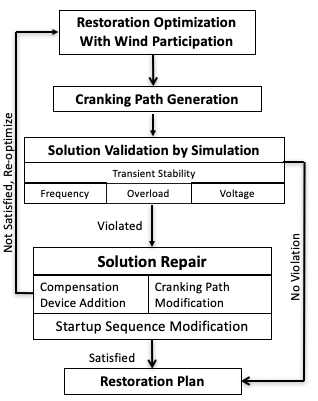

# Realistic Restoration Workflow

- Integrated restoration optimization model produces an initial parallel recovery plan
- Cranking path module finds transmission path to energize to crank a generator
- Transient stability and static security constraints are validated by simulation
- Three options to fix a restoration plan
 - Add compensation devices
 - Switch to another cranking path
 - Re-optimize startup sequences
- If a restoration plan cannot be repaired (or sacrifice too much solution quality), remove current plan from solution space and resolve the integrated restoration optimization model

