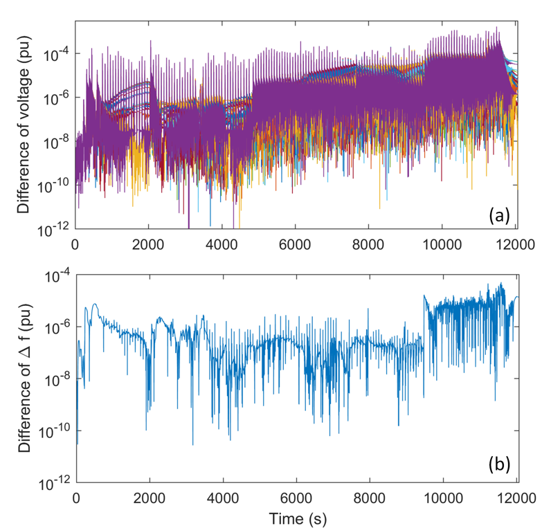

# Restoration Plan Optimization and Verification Workflow

- Integrated restoration optimization model produces an initial parallel recovery plan
- Cranking path module finds transmission path to energize to crank a generator
- Transient stability and static security constraints are validated by simulation
- Three options to fix a restoration plan
  - Add compensation devices
  - Switch to another cranking path
  - Re-optimize startup sequences
- If a restoration plan cannot be repaired (or sacrifice too much solution quality), remove current plan from solution space and resolve the integrated restoration optimization model


## Restoration Plan Optimization
### Interactive Usage
We can load and use the package using:
```julia
cd(@__DIR__)
push!(LOAD_PATH,"../src/")
using EGRIP
```
First, we need to tell the package where our problem data is. Assume the data is at the same directory of the executing script, then the data can be loaded as:
```julia
dir_case_network = "case39.m"
dir_case_blackstart = "BS_generator.csv"
```
Second, we need to tell the package where our results are going to be stored. Let's save the results in a child folder `results`:
```julia
dir_case_result = "results/"
```
Then, we define the restoration duration and time steps:
```julia
t_final = 300
t_step = 100
```
At last, we set the gap for the solver:
```julia
gap = 0.15
```
Once everything is ready, we can call `solve_restoration` function to solve the problem:
```julia
solve_restoration(dir_case_network, dir_case_blackstart, dir_case_result, t_final, t_step, gap)
```

Part of the results will be printed once the algorithm terminates.
```julia
Line energization:
stage 1.0:
stage 2.0:
stage 3.0: (8,9) (25,37) (16,17) (20,34) (22,23) (19,20) (22,35) (6,11) (9,39) (13,14) (5,8) (19,33) (26,27) (14,15) (12,13) (10,13) (15,16) (16,24) (12,11) (29,38) (16,19) (23,36) (6,31) (26,29) (23,24) (5,6) (4,14) (17,27) (25,26)

Generator energization:
stage 1.0: 39
stage 2.0:
stage 3.0: 36 33 38 31 37 34 35

Bus energization:
stage 1.0: 12 1 11 39 19 20 13
stage 2.0: 18 16 5
stage 3.0: 2 21 7 26 25 35 34 29 10 9 17 8 22 6 24 4 37 28 38 23 31 14 27 36 15 33
```
Detailed results will be stored in `results` folder under the directory containing the case file.

### Command Line Usage
Alternatively, we can build a command-line tool. First, we create a script file named `solve_bs.jl` and write the following Julia code in the script:
```julia
cd(@__DIR__)
push!(LOAD_PATH,"../src/")
using EGRIP
dir_case_network = ARGS[1]
dir_case_blackstart = ARGS[2]
dir_case_result = ARGS[3]
t_final = parse(Int64, ARGS[4])
t_step = parse(Int64, ARGS[5])
gap = parse(Float64, ARGS[6])
solve_restoration(dir_case_network, dir_case_blackstart, dir_case_result, t_final, t_step, gap)
```
Open `Terminal` and navigate to the directory containing `solve_bs.jl`.
```
$ cd /path to solve_bs/
```
Execute the following command:
```
$ julia solve_bs.jl 'case39.m' 'BS_generator.csv' 'results/' 300 100 0.15
```

## Restoration Plan Verification
### Restoration Plan File Generation
This process consists of two steps. The first step is to generate restoration plan file (an event list) using the function `generateRestorationPlanFromOpt
`. We need the following inputs:
- `optResPath`: The path containing the optimized restoration plan result
- `outFileName`: the name of the restoration plan file to be generated
- `dataFile`: The name of the associated system data file (PSAT format, .m)
- `dataPath` (optional): the path of the datafile
- `Options` (optional): extra options
The function will output `exitflag`, which 1 means success and fail otherwise. The function can be called using the following command:
```
generateRestorationPlanFromOpt('D:\Box Sync\Blackstart_data\Blackstart_data\','restoration_plan_test_039.m','d_datane_39_mod_PQ_3')
```

### Simulation
Once the event list is generated, we can run the simulation using the function `runDynamicSimulation`. We need the following inputs:
- `dataFile`: The name of the associated system data file (PSAT format, .m)
- `restSettingFile`: the name of the restoration plan file
- `dataPath` (optional): the path of the datafile
- `Options` (optional): extra options
There will be two outpus:
- `exitflag`=1: run the whole simulation, otherwise: DSA did not finish all the simulation
- `msg`: detailed message
The function can be called using the following command:
```
[flag,msg]=runDynamicSimulation('d_datane_39_mod_PQ_3','restoration_plan_test_039')
```

### Plots
Once the simulation is completed, we could load the simulation data:
```
Load the *_simp.mat result file (located in ./restoration/)
```
and plot the results:
```
plotCurves(1,t,stateCurve,SysDataBase,’variableName’)
```
The results of the IEEE 39-bus system are shown below.


