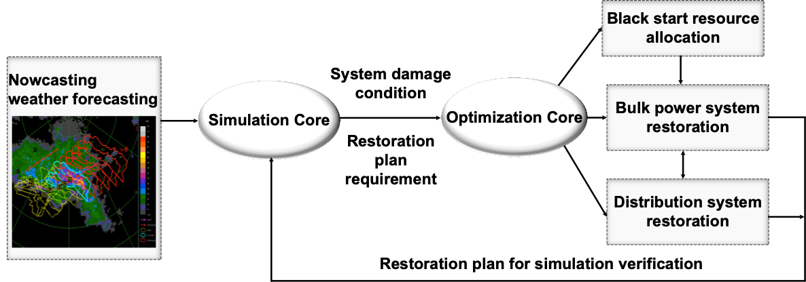
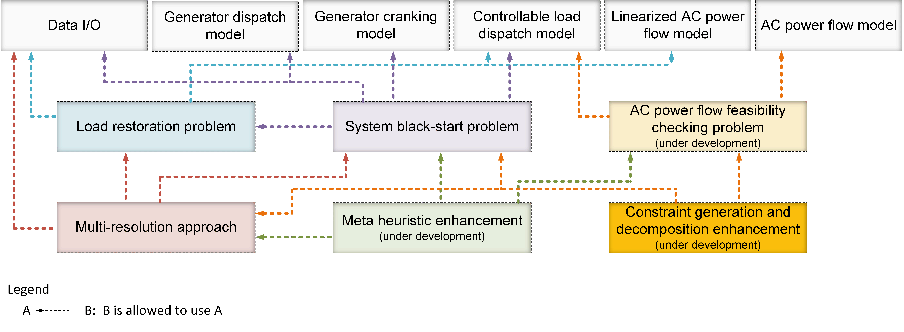

# EGRIP.jl Documentation

```@meta
CurrentModule = EGRIP
```
## Overview
Welcome to the documentation for `EGRIP.jl`!

`EGRIP.jl` (Electricity Grid Resilience Improvement Program) is a Julia/MATALB package for power system restoration planning and verification. The objective of this toolkit is to:
- Improve the preparedness of power systems for extreme weather conditions
- Enhance the capability of quick recovery from damages (such as partial or complete blackout)

The holistic framework shown below consists of three main modules: nowcasting weather forecasting, simulation and restoration.
- Simulation module provides predictive outages and damages, and dynamic security assessment for restoration plan to guarantee practicality
- Restoration module provides Multi-time scale (resource allocation and operation) multi-level (bulk power system and distribution level) restoration optimization




## Optimization Core
The optimization core is designed in a modularize and hierarchical manner to facilitate future algorithm development, multi-purpose usage as well as reduce the coding overhead. It consists of three levels, that is, fundamental function level, ordinary problem level and advanced solution level.
- The *fundamental function level* is to provide basic optimization formulations. Currently it consists of generator dispatch model, generator cranking model, controllable load dispatch model, linearized AC power flow model and AC power flow model as well as data I/O.
- The *ordinary problem level* formulates different problems using appropriate functions from both fundamental and its own levels. Currently there are three ordinary problems, that is, load restoration problem, system black-start problem and AC power flow feasibility checking problem. The load restoration problem is to a single-stage optimization to maximize served load under a fixed topology. The system black-start problem is built based on the load restoration problem to provide multi-stage restoration plans.
- The *advanced solution level* is to either speed up the computation or accommodate new capabilities using both state-of-the-art optimization algorithm and power system domain knowledge. Currently it consists of the multi-resolution restoration algorithm and meta heuristic enhancement. The multi-resolution restoration algorithm is to accelerate the overall solution time by guiding the search of higher-resolution problem using solutions from lower-resolution solutions. The meta heuristic enhancement uses power system domain knowledge and to add additional physical constraints and empirical rules to speed up the computation.



## Simulation Core
The simulation core is used for the resilience assessment of system under possible extreme events and in the restoration process. The simulation core utilizes the simulation tool based on *semi-analytical solutions (SAS)*. The SAS has enhanced numerical robustness and computational efficiency, which enables the analysis of very complex dynamic processes in large-scale power systems. The SAS-based simulation tool has the following major features:
* **Flexible customization of event sequences.** Users can conveniently define the event sequences through an event list file. The simulation tool supports various types of events, such as adding/tripping components, adding/clearing faults, ramping of load/ generation. The event scheduler dispatches the simulation workflow to simulate the event sequence.
* **Rich model library.** The simulation tool supports steady-state analysis and dynamic simulation. The model library includes dynamic models of synchronous generators, controllers (AVR and turbine governor), static load (e.g. ZIP) and induction motor load, and AGC model. And the model library is still expanding. The simulation tool admits widely supported PSAT data format.
* **Enhanced robustness.** The SAS as a high-order advanced computational approach with analytical form, has guaranteed numerical convergence to existing solution. Therefore, the SAS users are worry-free of non-convergence issues, and the simulation tool has good capability of performing very complex power system resilience analysis tasks.
* **Enhanced efficiency with steady-state & dynamic hybrid simulation.** The simulator automatically switches between full-dynamic simulation (where fast transients are significant) and quasi-steady-state (QSS) simulation (where the transients decay and approximately enters steady-state). The hybrid simulation scheme significantly saves computation time compared with the full-dynamic simulation, typically by 30%-70% depending on studied cases.
* **Friendly output and visualization functions.** The SAS-based simulation tool has a log system that enables printing and recording different levels of events in simulation. After simulation, users can conveniently plot the trajectories of various system states through a specially designed plotting function.


## Manual
- [Installation](@ref)
- [Mathematical Model](@ref)
- [Advanced Algorithms](@ref)
- [Restoration Planning and Verification Workflow](@ref)
## Library
- [Public Library](@ref)
- [Internal Library](@ref)
## Developer
- [Development Overview](@ref)
- [Code Loading](@ref)
- [Package Organization](@ref)
## Research
- [Literature Review](@ref)
- [Benchmark Testing](@ref)
