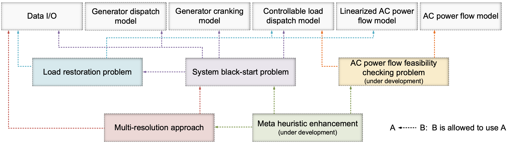

# EGRIP.jl Documentation

```@meta
CurrentModule = EGRIP
```
## Overview
Welcome to the documentation for `EGRIP.jl`!

`EGRIP.jl` is a Julia/JuMP package for power system restoration. The holistic framework is shown below.


To facilitate future algorithm development, multi-purpose usage as well as reduce the coding overhead, `EGRIP.jl` is designed in a modularize and hierarchical manner. It consists of three levels, that is, fundamental function level, ordinary problem level and advanced solution level.
- The fundamental function level is to provide basic optimization formulations. Currently it consists of generator dispatch model, generator cranking model, controllable load dispatch model, linearized AC power flow model and AC power flow model as well as data I/O.
- The ordinary problem level formulates different problems using appropriate functions from both fundamental and its own levels. Currently there are three ordinary problems, that is, load restoration problem, system black-start problem and AC power flow feasibility checking problem. The load restoration problem is to a single-stage optimization to maximize served load under a fixed topology. The system black-start problem is built based on the load restoration problem to provide multi-stage restoration plans.
- The advanced solution level is to either speed up the computation or accommodate new capabilities using both state-of-the-art optimization algorithm and power system domain knowledge. Currently it consists of the multi-resolution restoration algorithm and meta heuristic enhancement. The multi-resolution restoration algorithm is to accelerate the overall solution time by guiding the search of higher-resolution problem using solutions from lower-resolution solutions. The meta heuristic enhancement uses power system domain knowledge and to add additional physical constraints and empirical rules to speed up the computation.




## Manual
- [Quick Start Guide](@ref)
- [Mathematical Model](@ref)
- [Advanced Algorithms](@ref)
- [Realistic Restoration Workflow](@ref)
## Library
- [Public Library](@ref)
- [Internal Library](@ref)
## Developer
- [Development Overview](@ref)
- [Code Loading](@ref)
- [Package Organization](@ref)
## Research
- [Literature Review](@ref)
- [Benchmark Testing](@ref)
